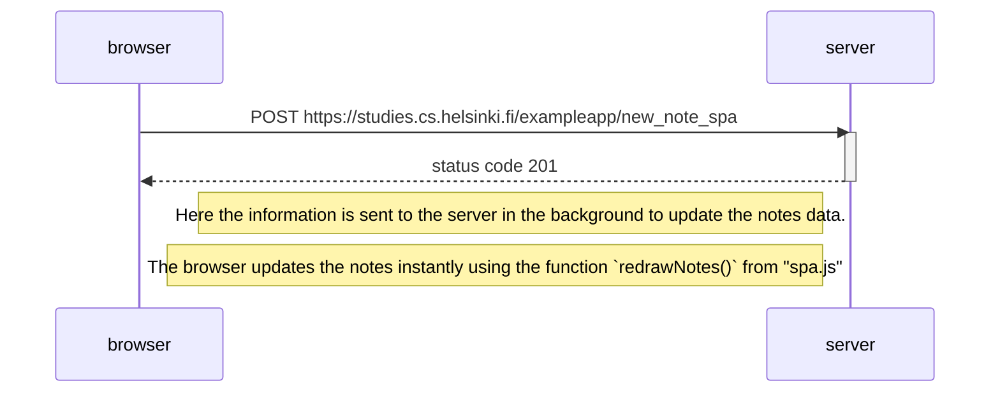

```mermaid
sequenceDiagram
    participant browser
    participant server
    
    browser->>server: POST https://studies.cs.helsinki.fi/exampleapp/new_note_spa
    activate server
    server-->>browser: status code 201
    deactivate server

    Note left of server: Here the information is sent to the server in the background to update the notes data.
    Note right of browser: The browser updates the notes instantly using the function `redrawNotes()` from "spa.js"
```